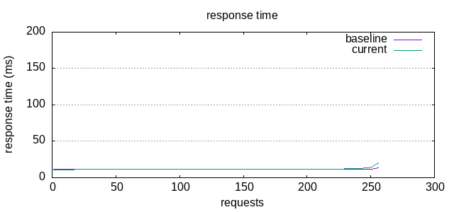
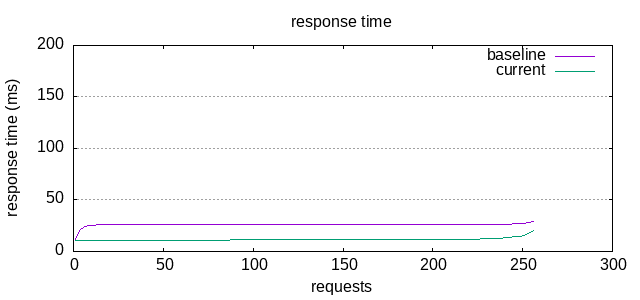
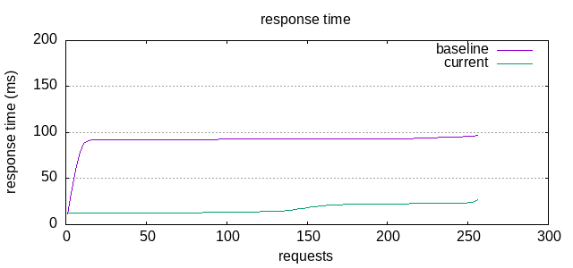

## First conclusions

Giving the first look at `app.py` we can see that it is single-threaded and that there are
probably 2 major bottlenecks:
1. The CPU cost of deserializing the JSON
2. The I/O wait cost of writing the CSV to disk

Another thought that rapidly comes to my mind is that we are receiving the data in chunks
but we are not doing any processing until we've received all of it. There is probably
an optimization opportunity to process the data as it comes.

## Profiling

Before doing any changes to the code I like to profile the application so I can
correctly measure the impact of each of the parts of the application and determine if my
conclusions are correct.

Running the server with `cProfile` will write a file with the profiling data.
```sh
❯ python3 -m cProfile -o prof.out app.py
```
Using `pstat` and doing some filtering and sorting on the profile data we can
see that by far most of the time of the application has been expended on the `post` method.
```sh
❯ python3 -m pstats prof.out
sort tottime
stats app.py
ncalls  tottime  percall  cumtime  percall filename:lineno(function)
1024    1.291    0.001   20.678    0.020 app.py:19(post)
9216    0.197    0.000    0.197    0.000 app.py:16(data_received)
1024    0.000    0.000    0.000    0.000 app.py:13(initialize)
	 1    0.000    0.000   28.484   28.484 app.py:1(<module>)
	 1    0.000    0.000   28.415   28.415 app.py:54(run)
	 1    0.000    0.000    0.000    0.000 app.py:11(DataReceiverHandler)
```
This only gives us a general view of where the application is spending its time,
with another tool, `line_profiler`, we will gain granularity and I'll be able to determine
exactly which lines are causing the CPU to struggle.
```sh
pip install line_profiler
kernprof -l app.py
python -m line_profiler app.py.lprof
```
```
Timer unit: 1e-06 s

Total time: 25.0222 s
File: app.py
Function: post at line 19

Line #      Hits         Time  Per Hit   % Time  Line Contents
==============================================================
    19                                               @profile
    20                                               def post(self):
    21      1024        765.0      0.7      0.0          records_valid = 0
    22      1024        465.0      0.5      0.0          records_invalid = 0
    23      2048      32424.0     15.8      0.1          with open(f"csv/nyc_taxi-{date.today()}.csv", 'a') as fw:
    24      1024        593.0      0.6      0.0              fieldnames = [
    25                                                           'vendorid',
    26                                                           'tpep_pickup_datetime',
    27                                                           'trip_distance',
    28                                                           'total_amount',
    29                                                       ]
    30      1024       4272.0      4.2      0.0              writer = csv.DictWriter(fw, fieldnames, extrasaction='ignore')
    31      1024        908.0      0.9      0.0              fr = io.BytesIO(self.request_body)
    32   1639424     737644.0      0.4      2.9              for record in fr.readlines():
    33   1638400     629732.0      0.4      2.5                  try:
    34   1638400   15769784.0      9.6     63.0                      row = json.loads(record)
    35   1638400    7011346.0      4.3     28.0                      writer.writerow(row)
    36   1638400     806184.0      0.5      3.2                      records_valid += 1
    37                                                           except Exception:
    38                                                               records_invalid += 1
    39      1024        538.0      0.5      0.0          result = {
    40      2048        886.0      0.4      0.0              'result': {
    41      1024        362.0      0.4      0.0                  'status': 'ok',
    42      1024        513.0      0.5      0.0                  'stats': {
    43      1024        732.0      0.7      0.0                      'bytes': len(self.request_body),
    44      1024        608.0      0.6      0.0                      'records': {
    45      1024        388.0      0.4      0.0                          'valid': records_valid,
    46      1024        400.0      0.4      0.0                          'invalid': records_invalid,
    47      1024        557.0      0.5      0.0                          'total': records_valid + records_invalid,
    48                                                               },
    49                                                           }
    50                                                       }
    51                                                   }
    52      1024      23144.0     22.6      0.1          self.write(result)
```
And we can see that by two orders of magnitude most of the time
is in fact spent while parsing the JSON and writing the CSV
```
34   1638400   15769784.0      9.6     63.0                      row = json.loads(record)
35   1638400    7011346.0      4.3     28.0                      writer.writerow(row)
```
The `json.loads` call is a CPU-bound issue and the `writer.writerow` too, since it
is not going to write anything to disk until we exit the scope of the call to `with open(f"csv/...`

Here is also a nice picture from `pyprof2calltree`


## First design

Since the CPU is struggling to keep up with the requests of the benchmark I am
going to help it make use of the rest of the cores that it has.
I am going to use:
- 1 core for the `tornado.web.Application` so we can handle the requests
- 1 core to write to the CSV file since if we write at the same time from multiple places to the same file, we are going to run into corruption issues.
- The rest of the cores (N-2) are to deserialize the JSON.

I [encountered an issue](https://stackoverflow.com/questions/10184975/ab-apache-bench-error-apr-poll-the-timeout-specified-has-expired-70007-on) with `ab`
when I introduced the `asyncio` behavior I had to also add the `-k` parameter to prevent it from hanging until it timed out.

The reality of this approach is that the cost of synchronization and communication between threads causes a bigger workload than just
processing everything on the same process, it ends up being counter-productive.

## Final design

I've just learned that you can open a file in append mode from multiple processes and Linux will handle it correctly as long as you write atomically:
- https://nullprogram.com/blog/2016/08/03/
- https://unix.stackexchange.com/a/346196/486990

So I ended up making use of `tornado.process.fork_processes(num_processes=None)` and let the framework to scale by itself, which worked well.






I've also tried other approaches like:
- [Moving the CSV writing to a queue to schedule it for later](https://github.com/GerardRodes/backend_test_tinybird/blob/1de607b078e9ee2e5794e6f36c41451055897438/app.py#L27-L31)
- [Move the JSON parsing to different processes with ProcessPoolExecutor](https://github.com/GerardRodes/backend_test_tinybird/blob/25acab00469645c2a619c46fdead2ad3bde0c13a/app.py#L108)

But none of those solutions have worked better than just doing the work on the same process and task.
Probably because process communication introduces extra workload.
And scheduling the write for later will just reorganize the work within the current event loop, but will not reduce the work, and it will endup writting the file just after it finishes the current requests.
